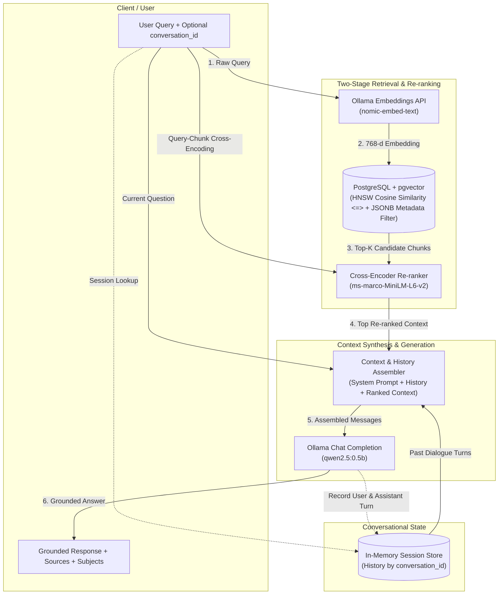
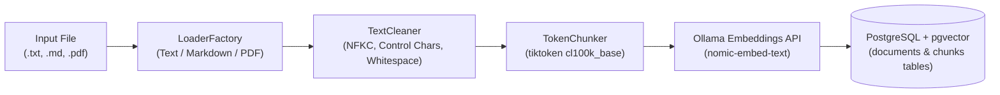

# Academic RAG Assistant

A robust, production-grade Retrieval-Augmented Generation (RAG) backend API built with **FastAPI**, **PostgreSQL with `pgvector`**, **Sentence-Transformers (Cross-Encoder)**, and **Ollama**.

This system automates end-to-end document ingestion (supporting `.txt`, `.md`, and `.pdf`), token-based chunking with configurable overlap, dense vector embedding generation, cosine similarity retrieval, cross-encoder re-ranking, multi-turn conversational memory, and LLM synthesis for precise, context-grounded question answering.

---

## Key Features

- **FastAPI REST Web Service**: Asynchronous endpoints for file uploading and ingestion (`/document/`), metadata-filtered vector similarity search (`/search/`), and multi-turn context-grounded chat (`/chat/`).
- **Multi-Format Document Ingestion**: Extensible `LoaderFactory` supporting plain text (`.txt`), Markdown (`.md`), and PDF (`.pdf`) documents.
- **Automated Text Cleaning**: Normalizes Unicode (NFKC), strips non-printable control characters, cleans HTML leftovers and section dividers, and standardizes whitespace.
- **Token-Based Chunking**: `TokenChunker` powered by `tiktoken` (`cl100k_base`) with configurable chunk token sizes and sliding overlap ratios.
- **PostgreSQL Vector Database**: Stores high-dimensional vector embeddings with HNSW indexing and cosine similarity (`<=>` operator) via `pgvector`.
- **Two-Stage Retrieval & Re-ranking**:
  - **Stage 1 (Dense Vector Retrieval)**: Retrieves top-$K$ candidate chunks from PostgreSQL using `nomic-embed-text` embeddings and JSONB metadata filters.
  - **Stage 2 (Cross-Encoder Re-ranking)**: Re-ranks retrieved candidates against the query using `sentence-transformers` (`cross-encoder/ms-marco-MiniLM-L6-v2`) to maximize semantic relevance and precision.
- **Multi-Turn Conversational Memory**: Stateful session tracking via `conversation_id`, preserving dialogue history across multiple turns while dynamically injecting retrieved context per turn.
- **Local Ollama Integration**: Asynchronous clients for embedding generation (`nomic-embed-text`) and context-grounded LLM answer synthesis (`qwen2.5:0.5b`).
- **Database Migrations with Alembic**: Version-controlled database schema migrations and indexing scripts.
- **Rich Terminal Feedback**: Real-time progress visualization during batch file processing using `rich`.

---

## Tech Stack & Dependencies

- **Framework**: [FastAPI](https://fastapi.tiangolo.com/) + [Uvicorn](https://www.uvicorn.org/)
- **Language**: Python 3.14+
- **Environment & Package Manager**: [uv](https://github.com/astral-sh/uv)
- **Database**: PostgreSQL 15+ with [`pgvector`](https://github.com/pgvector/pgvector) extension
- **Database Driver**: `psycopg` (v3 async binary)
- **Database Migrations**: `alembic`
- **Embedding & LLM Provider**: [Ollama](https://ollama.com/) (`nomic-embed-text:latest`, `qwen2.5:0.5b`)
- **Re-ranking Engine**: [Sentence-Transformers](https://sbert.net/) (`cross-encoder/ms-marco-MiniLM-L6-v2`)
- **Document Extractors**: `pypdf`, `beautifulsoup4`, `markdown`
- **Tokenization**: `tiktoken` (`cl100k_base`)
- **Data Validation & Settings**: `pydantic`, `pydantic-settings`
- **HTTP Client**: `httpx`
- **Terminal UI**: `rich`

---

## Project Structure

```
academic_rag_assistant/
├── alembic/                     # Database migrations (Alembic)
│   ├── versions/                # Migration revision scripts
│   │   └── 01c0273e078d_init_db.py
│   ├── env.py                   # Alembic environment configuration
│   └── script.py.mako           # Migration template
├── app/
│   ├── main.py                  # FastAPI application entry point & router registration
│   ├── config.py                # Pydantic-settings configuration & database URL resolution
│   ├── database/
│   │   └── vector_db.py         # Async PostgreSQL connection manager (psycopg3)
│   ├── ingestion/
│   │   ├── loaders.py           # Document loaders (Text, Markdown, PDF) & LoaderFactory
│   │   ├── cleaner.py           # Text cleaning, Unicode normalization & artifact removal
│   │   ├── chunker.py           # Token-based text chunking using tiktoken
│   │   ├── pipeline.py          # Pipeline orchestrator (Load -> Clean -> Chunk)
│   │   └── storage.py           # Uploaded file persistence to storage directory
│   ├── repository/
│   │   └── documents.py         # Database CRUD & pgvector cosine similarity search
│   ├── retrieval/
│   │   ├── retriever.py         # Dense vector retrieval & metadata filtering
│   │   └── reranker.py          # Cross-Encoder candidate re-ranking (SentenceTransformers)
│   ├── routers/
│   │   ├── chat.py              # POST /chat/ multi-turn RAG chat endpoint handler
│   │   ├── document.py          # POST /document/ upload & ingestion endpoint handler
│   │   └── search.py            # QUERY /search/ vector search & reranking endpoint handler
│   ├── schemas/
│   │   ├── chat_sch.py          # Pydantic schemas for RAG chat request/response
│   │   ├── document_sch.py      # Pydantic schemas for document ingestion & metadata
│   │   └── search_sch.py        # Pydantic schemas for similarity search
│   └── services/
│       ├── embedding_service.py # Async client for Ollama embeddings API
│       ├── file_service.py      # File processing, batch insertion & standalone pipeline
│       ├── llm_service.py       # Async client for Ollama chat completion API
│       └── rag_service.py       # Multi-turn RAG orchestrator (Retrieval + Rerank + History + LLM)
├── documents/                   # Document storage & sample dataset (.pdf, .md, .txt)
├── .env                         # Environment variables configuration file
├── alembic.ini                  # Alembic migration configuration
├── pyproject.toml               # Project metadata & dependency definitions
├── test.py                      # Standalone testing & batch document ingestion script
├── uv.lock                      # Lockfile for reproducible environment state
└── README.md                    # Project documentation
```

---

## Prerequisites

1. **Python 3.14+**
2. **PostgreSQL** (version 15+) with `pgvector` extension enabled.
3. **Ollama** installed and running with target models pulled:
   ```bash
   ollama pull nomic-embed-text:latest
   ollama pull qwen2.5:0.5b
   ```

---

## Configuration (`.env`)

Create a `.env` file in the root directory:

```env
# PostgreSQL Configuration
DB_NAME=postgres
DB_USER=postgres
DB_PASS=rayen
DB_HOST=127.0.0.1
DB_PORT=5432

# Local Ollama AI Engine Settings
OLLAMA_URL=http://localhost:11434
EMBEDDING_MODEL=nomic-embed-text:latest
LARGE_LANGUAGE_MODEL=qwen2.5:0.5b

# Cross-Encoder Re-ranker Model
CROSS_ENCODER_MODEL=cross-encoder/ms-marco-MiniLM-L6-v2
```

---

## Database Setup

### 1. Install pgvector

If not already installed on your PostgreSQL server, install `pgvector`:

```bash
# Install build tools and PostgreSQL development headers
sudo apt update
sudo apt install -y build-essential postgresql-server-dev-all git

# Clone and build pgvector
cd /tmp
git clone --branch v0.8.0 https://github.com/pgvector/pgvector.git
cd pgvector
make
sudo make install
```

### 2. Apply Migrations (Alembic)

Apply database migrations using Alembic:

```bash
uv run alembic upgrade head
```

Or execute the SQL schema directly on your PostgreSQL database:

```sql
-- 1. Enable vector extension
CREATE EXTENSION IF NOT EXISTS vector;

-- 2. Documents table
CREATE TABLE IF NOT EXISTS documents (
    id SERIAL PRIMARY KEY,
    filename VARCHAR NOT NULL UNIQUE,
    total_chunks INTEGER,
    metadata JSONB,
    created_at TIMESTAMP WITH TIME ZONE DEFAULT CURRENT_TIMESTAMP
);

-- 3. Vector Chunks table
CREATE TABLE IF NOT EXISTS chunks (
    id SERIAL PRIMARY KEY,
    document_id INTEGER REFERENCES documents(id) ON DELETE CASCADE,
    chunk_index INTEGER NOT NULL,
    content TEXT NOT NULL,
    embedding VECTOR(768),
    created_at TIMESTAMP WITH TIME ZONE DEFAULT CURRENT_TIMESTAMP
);

-- 4. HNSW Index for fast cosine similarity search
CREATE INDEX IF NOT EXISTS idx_chunks_embedding
ON chunks USING hnsw (embedding vector_cosine_ops);
```

---

## Installation & Running

1. **Install Dependencies**:
   ```bash
   uv sync
   ```

2. **Start the FastAPI Application**:
   ```bash
   uv run fastapi dev
   ```

3. **Access Interactive API Docs**:
   - Swagger UI: `http://127.0.0.1:8000/docs`
   - ReDoc: `http://127.0.0.1:8000/redoc`

---

## RAG & Retrieval Architecture



1. **Dense Vector Retrieval**: Queries are embedded using `nomic-embed-text` and compared against stored chunk embeddings using cosine similarity (`1 - (c.embedding <=> vector)`).
2. **Metadata Filtering**: Searches can be filtered by arbitrary document metadata keys (such as `course`, `subject`, `source`) stored in PostgreSQL `JSONB`.
3. **Cross-Encoder Re-ranking**: Candidate chunks are scored jointly with the query via `sentence-transformers` CrossEncoder (`cross-encoder/ms-marco-MiniLM-L6-v2`) to eliminate false positives and order passages by relevance.
4. **Conversational Memory**: Multi-turn history is preserved in memory by `conversation_id`. Prior questions and answers are provided to the LLM alongside freshly retrieved context.

---

## REST API Reference

### 1. Root Health Check
- **Endpoint**: `GET /`
- **Description**: Returns welcome status message.
- **Response**:
  ```json
  {
    "message": "Welcome To RAG assistant"
  }
  ```

---

### 2. Document Upload & Ingestion
- **Endpoint**: `POST /document/`
- **Content-Type**: `multipart/form-data`
- **Description**: Uploads a document (`.txt`, `.md`, `.pdf`), parses text, cleans artifacts, chunks by tokens, computes embeddings with Ollama, and stores records in PostgreSQL.
- **Form Parameters**:
  - `file` (*UploadFile*, required): Document file (`.txt`, `.md`, `.pdf`).
  - `metadata` (*str*, optional, default: `"{}"`): JSON string containing metadata. Requires `course` and `subject`, and supports additional custom key-value pairs (e.g., `source`, `author`).

- **Example `curl` Request**:
  ```bash
  curl -X POST "http://127.0.0.1:8000/document/" \
    -F "file=@documents/docker.md" \
    -F 'metadata={"course": "backend", "subject": "devops", "source": "docker.md"}'
  ```

- **HTTP Status Codes**:
  - `200 OK`: File processed, chunked, embedded, and stored successfully.
  - `409 Conflict`: File with identical filename already exists in the database.
  - `422 Unprocessable Entity`: Metadata JSON is invalid or missing required fields (`course`, `subject`).

---

### 3. Vector Similarity Search
- **Endpoint**: `QUERY /search/`
- **Content-Type**: `application/json`
- **Description**: Generates an embedding for the query, retrieves candidate chunks from PostgreSQL with cosine similarity and metadata filtering, and re-ranks them using the Cross-Encoder model.
- **Request Body**:
  ```json
  {
    "query": "How do containers provide process isolation?",
    "threshold": 0.5,
    "filters": {
      "course": "backend",
      "subject": "devops"
    }
  }
  ```
- **Body Fields**:
  - `query` (*str*, required): Search query string.
  - `threshold` (*float*, optional, default: `0`): Minimum similarity score threshold.
  - `filters` (*DocumentMetadata*, optional, default: `null`): Metadata filter matching document fields (`course`, `subject`, etc.).

- **Example `curl` Request**:
  ```bash
  curl -X QUERY "http://127.0.0.1:8000/search/" \
    -H "Content-Type: application/json" \
    -d '{
      "query": "How do containers provide process isolation?",
      "threshold": 0.5,
      "filters": {
        "course": "backend",
        "subject": "devops"
      }
    }'
  ```

- **Response Format**:
  ```json
  {
    "query": "How do containers provide process isolation?",
    "filters": {
      "course": "backend",
      "subject": "devops"
    },
    "result": [
      [
        "docker.md",
        0,
        "Docker uses Linux cgroups and namespaces to isolate processes...",
        0.8745,
        {
          "course": "backend",
          "subject": "devops",
          "source": "docker.md"
        }
      ]
    ]
  }
  ```
- **Result Item Tuple Format**:
  `[filename, chunk_index, content, similarity_score, document_metadata]`

---

### 4. Multi-Turn RAG Chat
- **Endpoint**: `POST /chat/`
- **Content-Type**: `application/json`
- **Description**: Performs two-stage retrieval (vector similarity search + Cross-Encoder re-ranking) for the user's question, attaches conversation history if `conversation_id` is supplied (or generates a new session), and prompts the LLM to generate a context-grounded response.
- **Request Body**:
  ```json
  {
    "user_question": "What is Docker and how does it achieve container isolation?",
    "conversation_id": null
  }
  ```
- **Body Fields**:
  - `user_question` (*str*, required): The question to ask.
  - `conversation_id` (*str*, optional, default: `null`): Existing session identifier to maintain multi-turn chat memory. If omitted or null, a new session is initialized.

- **Example Initial `curl` Request**:
  ```bash
  curl -X POST "http://127.0.0.1:8000/chat/" \
    -H "Content-Type: application/json" \
    -d '{
      "user_question": "What is Docker and how does it achieve container isolation?"
    }'
  ```

- **Initial Response Format**:
  ```json
  {
    "conversation_id": "a1b2c3d4",
    "result": "Docker is an open-source platform that enables developers to build, package, and run applications in isolated containers using Linux namespaces and cgroups...",
    "metadata": {
      "sources": [
        "docker.md"
      ],
      "subjects": [
        "devops"
      ]
    }
  }
  ```

- **Follow-up Multi-Turn Request**:
  ```bash
  curl -X POST "http://127.0.0.1:8000/chat/" \
    -H "Content-Type: application/json" \
    -d '{
      "user_question": "Can you summarize that in three bullet points?",
      "conversation_id": "a1b2c3d4"
    }'
  ```

- **HTTP Status Codes**:
  - `200 OK`: Query processed successfully with context-grounded response and session details.
  - `500 Internal Server Error`: LLM service failure or unreachable Ollama instance.

---

## Python Programmatic Usage

You can also interact directly with the core services in Python scripts:

```python
import asyncio
from pathlib import Path
from app.services.file_service import FileProcessor
from app.retrieval.retriever import retrieval
from app.retrieval.reranker import reranker
from app.services.rag_service import chat

async def main():
    # 1. Ingest and chunk a document
    doc_path = Path("documents/docker.md")
    metadata = {
        "course": "backend",
        "subject": "devops",
        "source": "docker.md"
    }

    processor = FileProcessor(file=doc_path, metadata=metadata, chunk_size=500, overlap_ratio=0.1)
    chunks = processor.chunking_file()
    doc_id = await processor.insert_file(chunks)
    if doc_id is not None:
        await processor.insert_chunks(doc_id, chunks)
        print(f"Document '{doc_path.name}' inserted with ID {doc_id}")

    # 2. Perform dense vector retrieval
    candidate_chunks = await retrieval(
        query="How do containers provide process isolation?",
        filters={"course": "backend", "subject": "devops"},
        top_k=10,
        threshold=0.5
    )
    print(f"\nRetrieved {len(candidate_chunks)} candidate chunks from vector DB.")

    # 3. Re-rank retrieved candidates with Cross-Encoder
    passages = [chunk[2] for chunk in candidate_chunks]
    ranked_results = await reranker(
        query="How do containers provide process isolation?",
        candidates=passages,
        top_k=3
    )
    print("\nTop Re-ranked Passages:")
    for rank in ranked_results:
        print(f"- [Score: {rank['rank_score']:.4f}] {rank['candidate'][:100]}...")

    # 4. Multi-turn RAG Chat
    turn1 = await chat(msg="Explain how Docker creates container isolation.")
    conv_id = turn1["conversation_id"]
    print(f"\n[Turn 1] Answer (Session {conv_id}):\n", turn1["response"])
    print("Sources:", turn1["sources"])

    # Follow-up turn using conversation_id
    turn2 = await chat(msg="What were the main kernel features mentioned?", conversation_id=conv_id)
    print(f"\n[Turn 2] Follow-up Answer:\n", turn2["response"])

if __name__ == "__main__":
    asyncio.run(main())
```

---

## Ingestion Pipeline Details



The document ingestion flow follows a multi-stage pipeline:

1. **Loader Stage (`app/ingestion/loaders.py`)**:
   - `LoaderFactory` detects file extension (`.txt`, `.md`, `.pdf`) and delegates to the appropriate loader.
   - Extracts raw text content: Markdown syntax is parsed and stripped of HTML formatting via `BeautifulSoup`; PDF documents are extracted page-by-page via `pypdf`.

2. **Cleaner Stage (`app/ingestion/cleaner.py`)**:
   - Applies Unicode normalization (`NFKC`) to convert ligatures and smart quotes.
   - Strips non-printable control characters while preserving structural newlines and tabs.
   - Strips leftover HTML tags and repetitive dividers (`---`, `***`, `===`).
   - Normalizes whitespace and standardizes paragraph boundaries.

3. **Chunker Stage (`app/ingestion/chunker.py`)**:
   - Tokenizes sanitized text using `tiktoken` (`cl100k_base`).
   - Slices text into overlapping windows controlled by `chunk_size` (tokens) and `overlap_percentage`.
   - Generates chunk dictionaries containing text content, token count, and chunk index.

4. **Embedding & Storage Stage (`app/services/file_service.py` & `app/repository/documents.py`)**:
   - Embeds each chunk into a 768-dimensional vector using Ollama (`nomic-embed-text`).
   - Inserts document metadata into `documents` table and vectorized chunks into `chunks` table with HNSW indexing.
